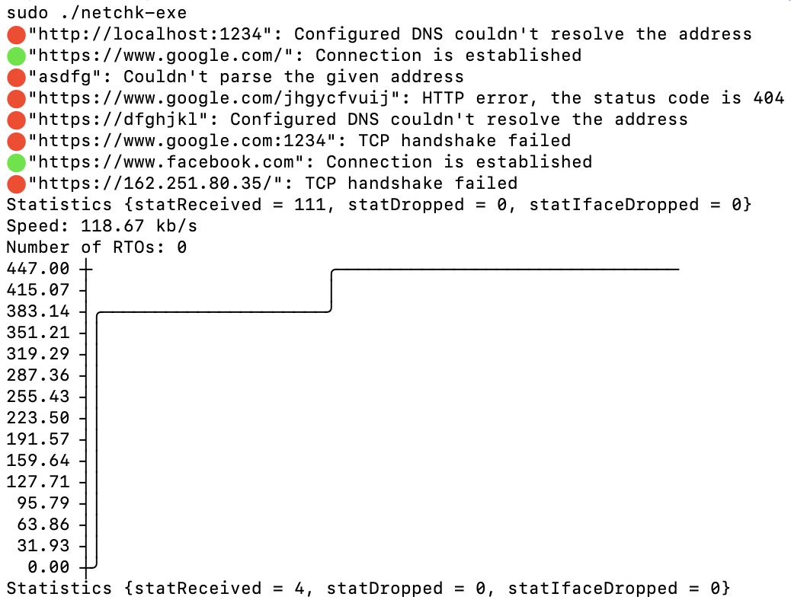

# Network Checker

The idea behind this app is to 

1 - check connection to a set of addresses provided (currently hardcoded) and return the result

2 - check the internet speed

The result for the first test is one of the following:
* Connection is established
* Couldn't parse the given address
* Configured DNS couldn't resolve the address
* TCP handshake failed
* TLS handshake failed
* HTTP-level error, the status code is ...
* Connection failed, the problem is unknown

After running bandwidth test the program returns the speed and connection graph.

## Installation

The app works on linux machines only.

Required packages:

`libpcap-dev`

### Usage:
To run both connection and bandwidth tests, one after another:

`./netchk-exe`

To run connection tests:

`./netchk-exe --mode connection`

To run bandwidth tests:

`./netchk-exe --mode bandwidth`

